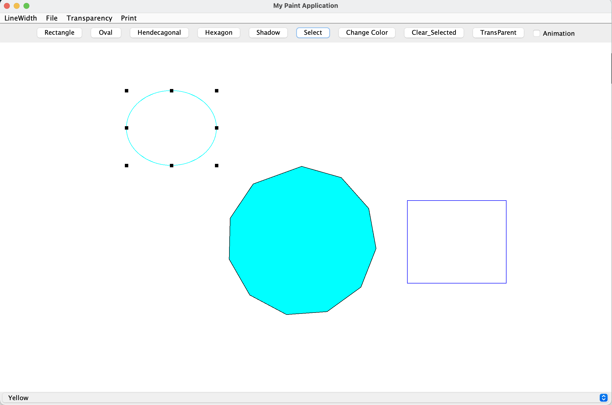

# お絵かきツール
## 概要
図形を描画するようなお絵かきツールです。図形の色を変更する際にバグが起きることがあります。
## コンパイル
以下のようにコマンドを打てば動きます。  
`javac *.java`  
`java MyApplication`
## 使い方
アプリを起動すると、項目が隠れているのでウィンドウを大きくしてもらうと全てのメインメニューが表示されます。
初期状態ではRectangle(四角形)が選択されており、下のキャンバス(白い箇所)でドラッグをすると好きな大きさの四角形を作成することができます。他のメインメニューは以下のようになっています。  
- Oval(楕円)  選択すると楕円を描画します。
- Hendecagonal(多角形) 11角形を描画するように設定しています。
- Hexagon(6角形) 6角形を描画します。
- Shadow 後述するSelectで選択されている図形に対して影をつけます。もう一度押すと影を消すこともできます。
- Select 図形を選択します。選択されている図形はわかりやすいように周りが囲まれます。複数選択をする場合はドラッグをして選択したい図形を囲むことで選択できます。
- Change Color 選択されている図形や枠線の色を変更します。下にプルダウン形式のバーが出てくるのでそこから選んでください。他の色はOtherを選ぶとJFileChooserが開きます。
- Clear_Selected 選択状態を解除します。
- TransParent 選択している図形に対して透明度を付与します。
- Animation 選択されている図形の色が変わりながら、左から右へ移動していき画面外で図形が削除されます。 
   
また、メインメニューの上に表示されているサブメニューは以下のようになっています。
- LineWidth 選択している図形の線の太さを変更します。
- File Outputで現在キャンバスに描かれている図形を保存します。InputはOutputで保存したファイルを選択するとキャンバスに保存された図形が描画されます。
- Transparency 押すと表示されるメーターを動かすことで透明度を変更できます。
- Print Printでキャンバスを印刷することができます。Imageは画像としてキャンバスを保存することができます。

さらに、図形を選択している状態で右クリックをすると次のメニューが表示されます。
- Cut 図形を切り取ります。
- Copy 図形をコピーします。
- Delete 図形を削除します
- Paste 切り取った図形を貼り付けます。
- Move_TheFront 重なっている図形を前面に表示します。
- Move_TheBack 重なっている図形を背面に表示します。  
右クリックを押したまま動かすと選択されている図形を移動させることもできます。
## 実際のプレイ画像

